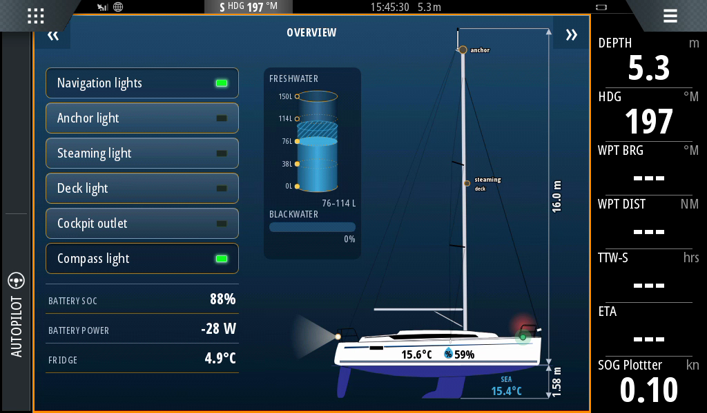
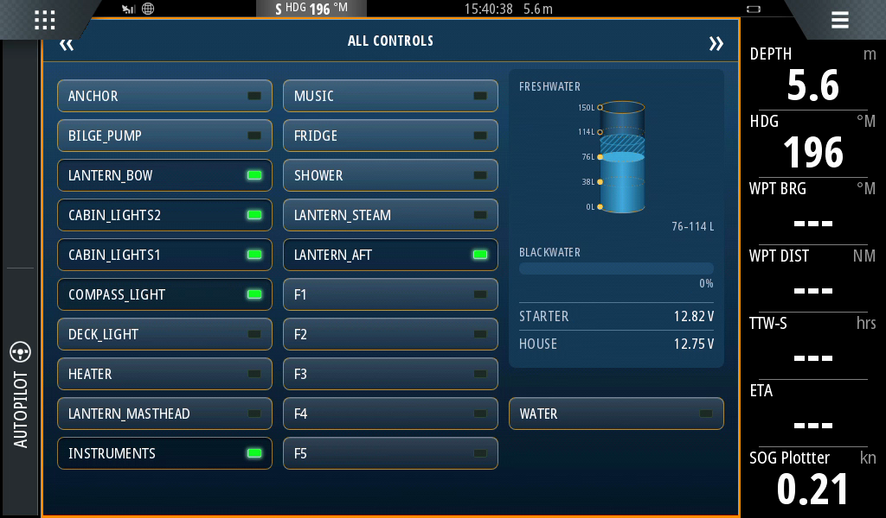
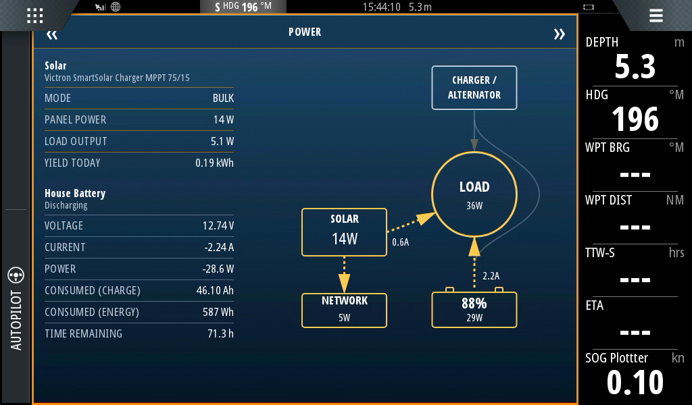
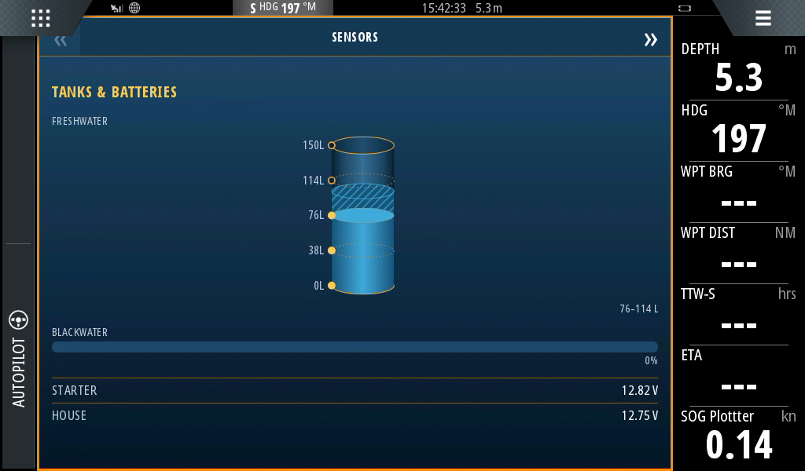
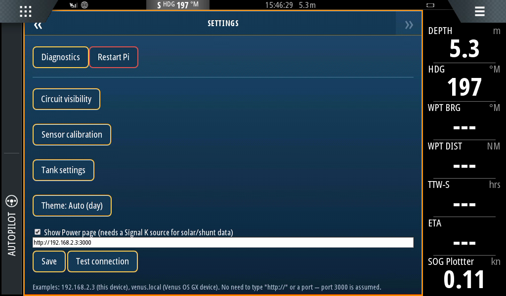

# Virtual Bavaria Panel

A gateway that lets a Raspberry Pi act as a second control panel on Bavaria yachts with a CAN bus
panel [12V control panel with USB charger](https://www.svb24.com/en/bavaria-control-panel-12-v-incl-usb-cigarette-lighter-socket.html)
fitted as standard on many modern Bavaria yachts, including Bavaria Cruiser 34, 37, 41, 46, 51, 56.
Tested on a Bavaria Cruiser 34 from 2022.

Virtual Bavaria Panel takes over control of the relay board to let a web app control the relays,
such as turning on/off navigation lights, while still being able to control them via the existing
physical panel. Unfortunately, the physical panel will not indicate updated relay status. Turning
the gateway off hands control back to the panel alone. See `architecture.md` for the full design.

It reads tank sensors (freshwater and blackwater) and house battery voltage from the Bavaria panel.

In addition, it (optionally) integrates with Signal K to show you temperature sensors and
electrical power readings, such as Victron Smart Shunt and Smart Solar.

## Screenshots

Running as an app on a B&G Zeus3 7 chartplotter:

<br>Temperatures and battery power read via Signal K

| All Controls | Power |
|---|---|
|  <br>All data from panel/switchboard, you can select what buttons to show in settings 'Circuit visibility'. |  <br>Optional page if you have Signal K. All data populated via bt-sensors-plugin-sk. |
| **Sensors** | **Settings** |
|  <br>Tank and voltage sensors read from the Bavaria panel. |  Customizable to fit your setup.|

## What you need

- A Linux computer, e.g. a Raspberry Pi, with a CAN interface wired inline on cable between the 
  panel and relay-board — see `pinout.md` for the connector pinout.
- A web browser, such as on a phone, and/or a Multi Functional Display (MFD), such as a
  chartplotter. For B&G plotters you need an ethernet cable connected to the plotter, see the
  Navico MFD app section below.

## Documentation map

- **`architecture.md`** — design: takeover mechanism, arbitration between panel/web commands,
  the gateway state machine.
- **`protocol_findings.md`** — confirmed bus protocol and findings.
- **`panel_od_map.md`** — object-dictionary sweep of the physical panel.
- **`pinout.md`** — the connector pinout between panel and bus.
- **`dev-environment.md`** — toolchain, repo layout, and both the simulated dev loop and the
  real-hardware validation loop.
- **`mfd_display_notes-zeus3-7.md`** — the MFD's (B&G Zeus3) browser capabilities and
  screen/split-layout dimensions, for designing the web UI offline.

## Running it

To run it simulated for development (after `./setup_venv.sh`), run `./run_simulated.sh`. This
brings up a command line simulating the physical panel, as well as the gateway with the webapp
served at `localhost:8000`. See `dev-environment.md` for what it's running or how to run each
process separately.

To try it against your own real bus without the full deployment below, run `./run_hardware.sh`
(after `./setup_venv.sh`) — it brings up `can0` and starts the gateway. The webapp and API are both
served together at `http://<this host>:8000/`. Ctrl-C releases control back to the panel.

## Deployment (Raspberry Pi, real bus)

Deployment artifacts live under `deploy/`, mirroring their destination paths under `/`.

### Gateway service

Two systemd units, ordered so the bus interface is always up before the gateway starts:

- **`vbp-can0.service`** — oneshot, brings up `can0` at the bus's confirmed parameters. Idempotent
  whether or not the interface was already up.
- **`vbp-gateway.service`** — runs `python -m gateway.main --activate` as an unprivileged user,
  `Requires=`/`After=vbp-can0.service`, `Restart=on-failure`. Stopping it (or a reboot) always
  cleanly hands control back to the panel first.

Install:

```bash
sudo cp deploy/etc/systemd/system/vbp-can0.service deploy/etc/systemd/system/vbp-gateway.service /etc/systemd/system/
sudo systemctl daemon-reload
sudo systemctl enable --now vbp-can0.service vbp-gateway.service
```

Configuration is via environment variables read by `gateway/config.py` (CAN interface/channel, web
port, log level, etc.) — set them in the unit file if the defaults (`socketcan`/`can0`, port
`8000`) don't apply.

The webapp's Settings page has a "Restart Pi" button (`POST /system/restart`), which shells out to
`sudo systemctl reboot`. The gateway runs as an unprivileged user, so that user needs passwordless
sudo for it — add a sudoers drop-in:

```bash
echo 'ola ALL=(ALL) NOPASSWD: /usr/bin/systemctl reboot' | sudo tee /etc/sudoers.d/vbp-restart
```

(replace `ola` with whichever user runs `vbp-gateway.service`). Without this, the button's request
will do nothing.

### Virtual Panel as a webapp

`webapp/` is the static frontend; the gateway's built-in REST server (`gateway/web.py`, uvicorn on
`127.0.0.1:8000`) serves it directly and handles the API calls. `lighttpd` just holds privileged
port 80 and reverse-proxies everything to uvicorn —
`deploy/etc/lighttpd/conf-available/20-vbp-proxy.conf`. It works as an ordinary webpage — any
browser on the network can load it and control the panel.

#### Navico MFD app

It can also show up as an app tile directly on Navico (B&G/Simrad/Lowrance) chartplotters using the
Navico UDP multicast announcement protocol. See `navico-app-announce.md` for deployment,
configuration, and troubleshooting.

**Requirement:** the MFD only discovers/loads the app over its **wired Ethernet** connection — WLAN
will not work for discovery.

Tested working on a B&G Zeus3 — see `mfd_display_notes-zeus3-7.md` for what its embedded browser
does and doesn't support.
