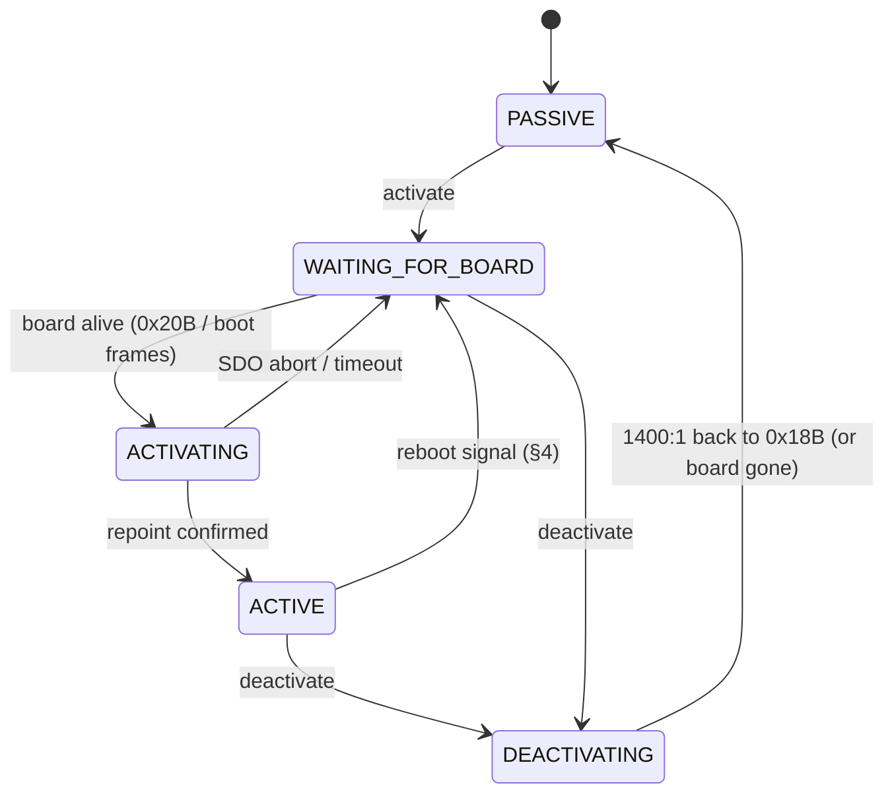

# Virtual Bavaria Panel — Architecture

## 1. Overview

**Goal: let a Raspberry Pi act as a second control panel on a single shared bus.**

Virtual Bavaria Panel is a gateway attached to the CANopen bus shared by the
existing control panel and the existing relay board. When initiated, it
reconfigures the relay board — live, over SDO — to listen to the gateway
instead of the panel. The gateway then mediates both a Virtual Panel
(controlled via a web app) and the existing physical panel to command the
relay board. When turned off, control is returned solely to the panel.

Target deployment platforms are Ubuntu on Raspberry Pi 5 and possibly Victron
Venus OS (also Pi 5 capable). Development uses simulators in place of the
physical panel and relay board (see `dev-environment.md`).

### 1.1 Out of Scope / Explicitly Deferred

- IMPORTANT: The existing panel will not update its internal state unless
  the change originated from itself, so its display may show stale state
  while the gateway is in control. Fixing this is out of scope.
- Containerization (Docker) — not pursued for either deployment target.
- NMT master role — not implemented; not needed on this bus.
- Time acceleration/simulation — not needed for this project.

## 2. Deployment Targets

| Aspect | Ubuntu (Pi 5) | Venus OS |
|---|---|---|
| CAN transport | `socketcan` | `socketcan` |
| Service supervision | systemd | daemontools (Venus OS package mechanism) |
| Packaging | plain Python / systemd unit | Venus OS package format |

A single CAN interface (e.g. `can0`) is sufficient on all targets — there is
only one bus. What differs is service supervision and packaging. Application
code, configuration mechanism, and CAN transport handling are identical
across targets — only environment values (channel name, bitrate) change.

## 3. System Diagram

There is a single physical CANopen bus shared by all three devices. The
gateway sits "between" panel and relay board only logically, by repointing
the relay board's PDO consumption (see §4).

```
[Control Panel] ────┐
                    │
[Relay Board] ──────┼── shared CANopen bus
                    │
[Gateway (Pi)] ─────┘
       |
 (REST + WebSocket)
       |
   [Web App]
```

## 4. Relay Takeover Mechanism

Protocol-level details (frame layout, object dictionary, confirmed
writability) live in `protocol_findings.md`; this section summarizes the
mechanism.

- In normal (panel-only) operation, the relay board's RPDO consumes the
  panel's TPDO: RPDO COB-ID (object `1400:1`) = `0x18B`.
- To take over, the gateway repoints `1400:1` from `0x18B` to the gateway's
  own TPDO COB-ID `0x18C`, live over SDO, using the confirmed
  disable → set → enable sequence (`0x8000018B` → `0x8000018C` →
  `0x0000018C`). The board then obeys `0x18C` and ignores the panel's
  `0x18B`.
- Both `0x18B` and `0x20B` are streamed periodically on the real bus. While
  active, the gateway likewise streams `0x18C` continuously (at the panel's
  cadence), alternating the alive-toggle bit (byte 0, bit 0) on every
  frame — the board treats a source with a static toggle bit as dead and
  ignores its commands.
- The change is **volatile**: a power cycle of the relay board reverts
  `1400:1` to `0x18B`, restoring panel control.
- **Failure recovery:** if the gateway crashes or hangs while in control,
  the accepted recovery procedure is to power-cycle the relay board — no
  watchdog or automatic revert is implemented.
- On graceful shutdown/deactivation, the gateway writes `1400:1` back to
  `0x18B` itself.
- **Relay reboot detection:** if the relay board power-cycles while the
  gateway is active, control silently reverts to `0x18B`. Since `0x20B`
  resumes after the reboot (echoing the panel again), a silence gap alone
  may be brief; the gateway therefore watches three signals, any of which
  resets the state machine: (1) loss of `0x20B` confirm traffic, (2) the
  board's `0x495` boot announcement, (3) `0x20B` echo no longer matching
  the gateway's last commanded state. Any of them drops the state machine
  back to WAITING_FOR_BOARD (§6), from which the takeover is re-run before
  the gateway resumes mediating.

## 5. Command Arbitration

- **Last write wins.** The most recent command from either source — physical
  panel or web app — takes effect. The panel has no priority over the web
  app, and vice versa.
- Because the bus is shared, the panel's TPDOs remain visible at `0x18B`
  even while the relay board ignores them. The gateway consumes them and
  treats *state changes* as commands (edge-triggered). Example: the web app
  turns a channel on that the panel has off — it is on. If the panel is then
  toggled on and off, the channel turns off.
- The panel remembers its relay state across power cycles and re-asserts it
  shortly after boot (`startup2` capture). The gateway treats that
  re-assertion like any other panel change — last write wins.
- The gateway — not the panel — is the source of truth for system state. The
  web app reflects gateway state; the physical panel's own display may show
  stale state (see §1.1).

## 6. Gateway State Machine

Steady states are adjectives, in-progress transitions are "-ing" names
(following the systemd `activating`/`active`/`deactivating` convention).



- **PASSIVE** — the gateway only observes the bus; the board obeys the
  panel directly. The web app can still show live panel/board state,
  read-only.
- **WAITING_FOR_BOARD** — activation requested; waiting for evidence the
  board is alive (`0x20B` traffic flowing, or its one-shot `0x495`/`0x715`
  boot frames) before attempting the repoint.
- **ACTIVATING** — performs the disable → set → enable repoint of `1400:1`
  (§4). SDO abort or timeout returns to WAITING_FOR_BOARD.
- **ACTIVE** — the gateway is the gate: streams `0x18C` with alternating
  toggle bit, arbitrates panel edges vs web commands (§5), and watches the
  reboot signals (§4). Any reboot signal drops back to WAITING_FOR_BOARD,
  from which the takeover is automatically re-attempted.
- **DEACTIVATING** — writes `1400:1` back to `0x18B`, then PASSIVE. If the
  board is unreachable, PASSIVE is entered anyway — the repoint is
  volatile, so a board power cycle restores panel control regardless.

## 7. CAN Abstraction Layers

```
App's domain logic (panel/relay modules)
        |
   canopen library (SDO/PDO, object dictionary)
        |
   python-can (udp_multicast / socketcan)
        |
   ── bus ──
        |
   python-can (udp_multicast)
        |
   canopen library (as a CANopen *node*, not master)
        |
Simulator's node logic (panel_sim / relay_sim)
```

`python-can` is the only layer that changes between environments — its
backend is selected by config: `udp_multicast` for local dev (rationale in
`dev-environment.md`), `socketcan` on target. `canopen` and everything
above it (interfaces, state machine) are unaware of which backend is in
use.

## 8. Bus Behavior

The full COB-ID inventory and frame details live in `protocol_findings.md`;
this is what the design relies on:

- CANopen (CiA 301) at 250 kbit/s. Panel is node 11 (`0x0B`), relay board is
  node 21 (`0x15`).
- Neither device emits NMT: the only `0x000` frames ever observed were
  Pi-originated during the protocol investigation; passive captures show
  none. Panel and board boot into Operational on their own, and the gateway
  needs no inbound NMT handling.
- The gateway consumes `0x18B` (panel commands), `0x20B` (board confirm),
  `0x715` (board boot-up, one-shot), `0x495` (board boot announcement), and
  `0x095` (board EMCY — tolerating the benign `0x8120` startup bursts); it
  produces `0x18C` and SDO requests. There is no periodic heartbeat on the
  bus (`1017` = 0).

## 9. Components and Interfaces

### Components

- **gateway** — the core application. Mediates between panel and relay,
  owns system state, exposes the web interface.
- **webapp** — frontend consuming the gateway's web interface.
- **simulators** — development/test doubles standing in for the physical
  panel and relay board (`panel_sim`, `relay_sim`).

### Gateway's Interfaces

- **panel_interface** — CANopen side, communicates with the control panel
  (real or simulated). Consumes the panel's PDOs, may issue SDO
  reads/writes.
- **relay_interface** — CANopen side, communicates with the relay board
  (real or simulated). Issues command PDOs on `0x18C`, consumes the board's
  confirm/echo PDO (`0x20B`) as the authoritative relay status, and watches
  EMCY (`0x095`). Performs the takeover/release writes to `1400:1`.
- **web_interface** — REST + WebSocket, exposed for the web app (or any
  other client) to observe state and issue commands.

### Gateway's Internals

- **state_machine** — implements the state machine in §6: owns system
  state and transitions, applies the last-write-wins arbitration between
  panel-originated and web-originated commands (§5), and handles the relay
  takeover, release, and reboot fallback (§4).
- **config** — loads and validates settings (CAN transport, channel,
  bitrate, web port, etc.), sourced from environment variables with
  sensible defaults.

## 10. Object Dictionaries

- The key objects are confirmed by SDO investigation (`protocol_findings.md`):
  state objects `0x4000` (outgoing/broadcast) and `0x4001` (incoming), and
  PDO configuration at `1400`/`1600`/`1800`/`1A00`. Panel and board run the
  same OD/firmware stack (`CODEVICE`, v4.5) in mirrored roles — the board
  folds its RPDO inbox into `0x4000` and the relays; the panel does not.
- EDS files for the two devices are authored from these findings and shared
  between the gateway and the simulators, so both sides agree on
  indices/subindices and PDO mappings.
