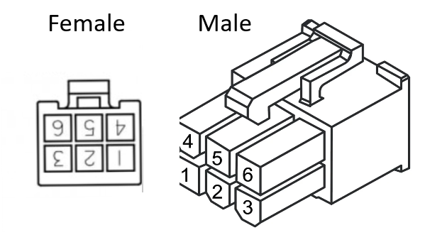
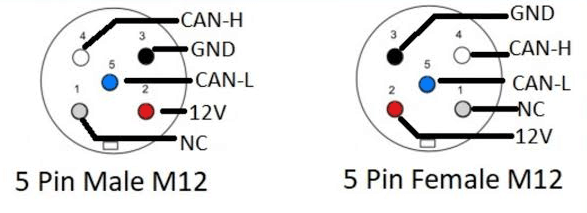

# Bavaria Control Pannel and Switchboard cable
 
The Bavaaria Yacats control pannels are connected to a relay-hborad using a standard Molex 6‑pin connector.

## Molex 6‑Pin Connector

Below is an image of the connector for reference:

## Pinout Table

| Pin | Signal Name         | Color  |
|-----|---------------------|--------|
| 1   | +12V                | Gray   |
| 2   | Ground              | Green  |
| 3   | ? resistance to 12V | Brown  |
| 4   | CAN L               | Pink   |
| 5   | Ground              | Yellow |
| 6   | CAN H               | White  |

# NMEA 2000 
For the NMEA2000 bus, there are standardized waterproof M12 connectors using shielded 5-pin micro-C with A coding. 

## NMEA 2000 micro-c Connector

The device shall use male.

## Ponout table
Color schema used in this project (and others)

| Pin | Function / Signal | Standard Wire Color | Description |
| :--- | :--- | :--- | :--- |
| **1** | Shield / Drain | Bare / Silver (or Black) | Ground / Drain wire for shielding |
| **2** | NET-S (Power +) | Red | Power Positive (+12V DC) |
| **3** | NET-C (Power –) | Black | Ground |
| **4** | CAN-H (Signal High) | White | CAN Data High |
| **5** | CAN-L (Signal Low) | Blue | CAN Data Low |
